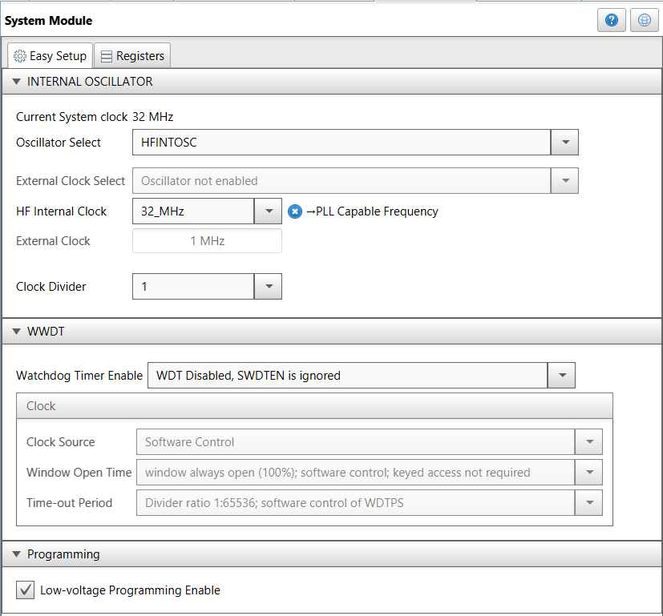
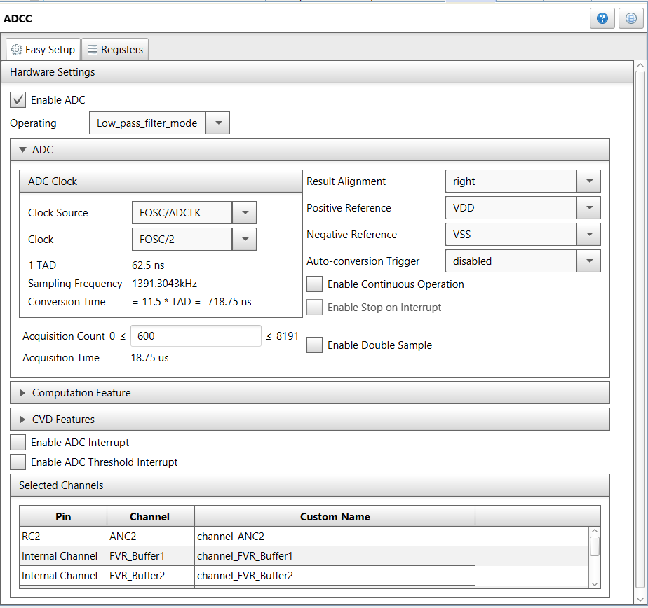
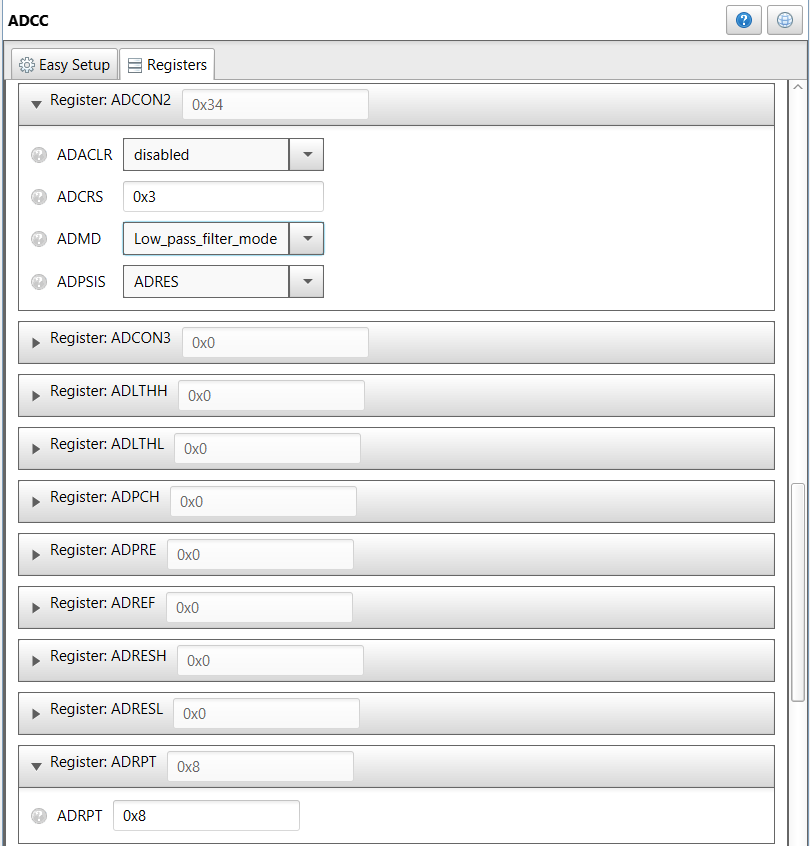
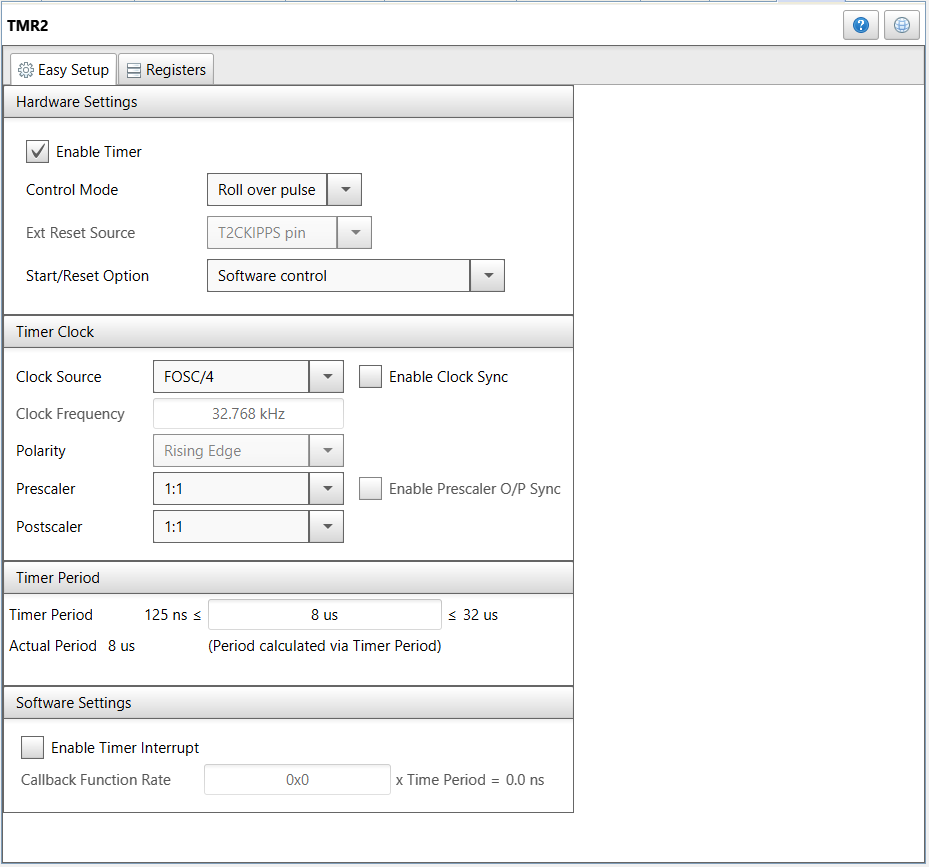
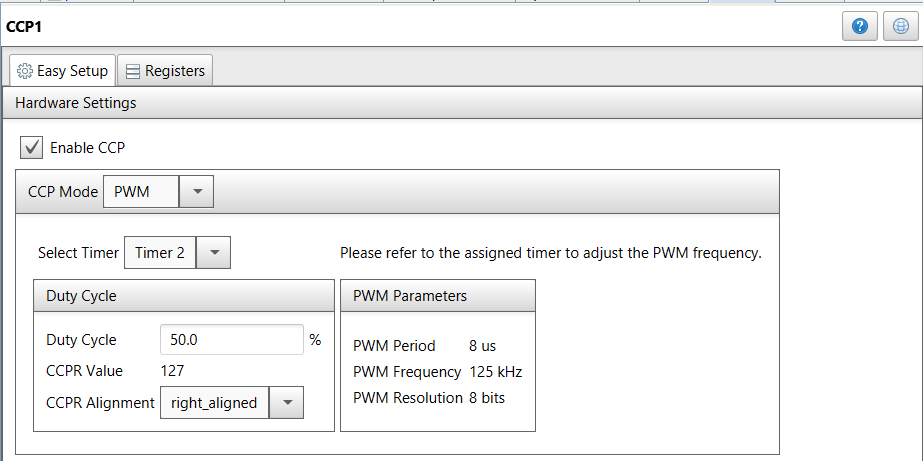
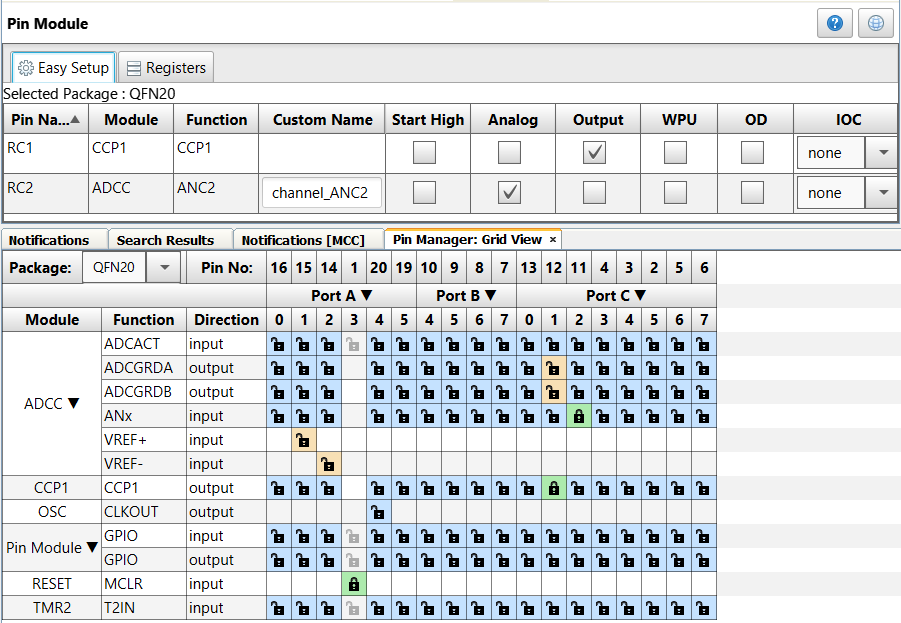
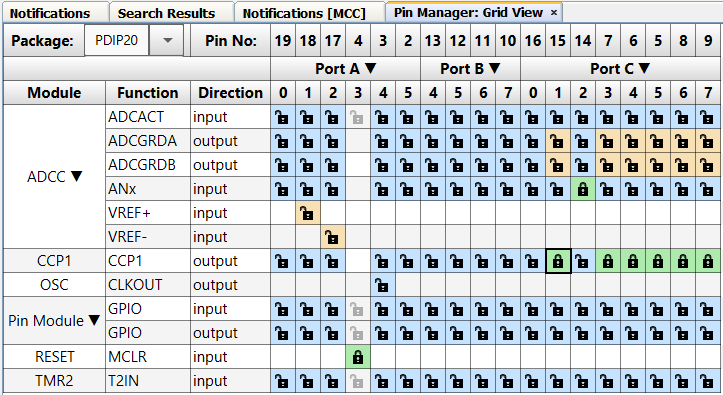
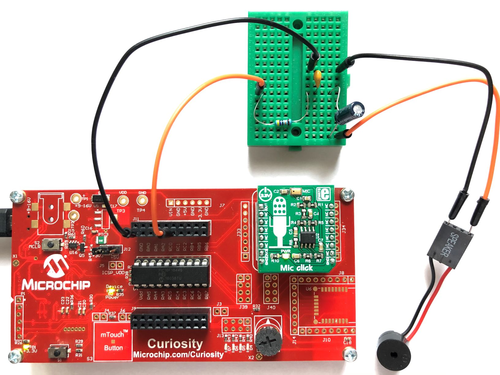
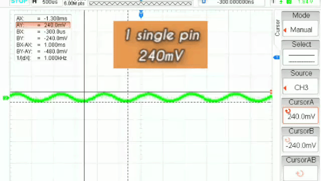

[](https://www.microchip.com)

# Pass-Through Audio Demo Using ADCC

The PIC16F18446 features a 12-bit ADC with Computation (ADCC) module. In this demo, the ADCC is used to read the MIC Click Board™, then that value is adjusted and passed thru CCP1 as PWM audio output.

## Related Documentation
- [PIC16F18446 Product Family Page](https://www.microchip.com/design-centers/8-bit/pic-mcus/device-selection/pic16f18446)
- [PIC16F18446 datasheet](http://ww1.microchip.com/downloads/en/DeviceDoc/40001985B.pdf) for more information or specifications.

## Software Used
- MPLAB® X IDE 5.30 or newer [(microchip.com/mplab/mplab-x-ide)](http://www.microchip.com/mplab/mplab-x-ide)
- MPLAB® XC8 2.10 or newer compiler [(microchip.com/mplab/compilers)](http://www.microchip.com/mplab/compilers)
- MPLAB® Code Configurator (MCC) 3.95.0 or newer [(microchip.com/mplab/mplab-code-configurator)](https://www.microchip.com/mplab/mplab-code-configurator)
- MPLAB® Code Configurator (MCC) PIC10/PIC12/PIC16/PIC18 library v1.79.0 or newer [(microchip.com/mplab/mplab-code-configurator)](https://www.microchip.com/mplab/mplab-code-configurator)

## Hardware Used
- PIC16F18446 PDIP20 with Curiosity Development Board [(DM164137)](https://www.microchip.com/Developmenttools/ProductDetails/DM164137)
- Alternatively PIC16F18446 Curiosity Nano [(DM164144)](https://www.microchip.com/DevelopmentTools/ProductDetails/PartNO/DM164144) with Curiosity Nano Base for Click Boards™ [(AC164162)](https://www.microchip.com/Developmenttools/ProductDetails/AC164162)
- MIC click board™ [(MIKROE-2563)](https://www.mikroe.com/mic-click)
- RC filter, wires and a small Breadboard for connections
- PC speaker (12 Ohm) or headphones (32 Ohm)

## Setup
This section shows the settings used in the demo for PIC16F18446 modules.
These were done using the Microchip Code Configurator (MCC). Open MCC to configure the modules:

### System Module Settings
The MCU uses the high frequency internal oscillator (HFINTOSC), and the clock is set to 32 MHz. 
Watchdog Timer is not used in this demo, so it is disabled.



### ADCC Settings
From Device Resources add ADCC peripheral, 
The ADCC is configured with a clock of FOSC/2, Low_pass_filter_mode.




For the Low pass filter mode, there are 2 more settings that must be configured from the Registers view. 
They are ADRPT and ADCRS. With these settings below, the filtering will use 8 ADC samples:




### TMR2 Settings
From Device Resources add TMR2 peripheral, it is used as PWM source for CCP1, 
Configure it with following options:

 

### CCP1 Settings
From Device Resources add CCP1 peripheral, 
Configure it with following options:

 

### Pin Module Setttings
From Project Resources select Pin Module,
Configure it with following options:



The following pin configurations must be made for this project:

|Pin           | Configuration      |
| :----------: | :----------------: |
|RC1           | Digital PWM output |
|RC2           | Analog ADCC input  |

Additional, to increase the audio output from the PIC18F18446, more pins (RC3, RC4, RC5, RC6..) can be configured in paralel using CCP1 module:




### RC filter
The RC filter is composed of R1 (33 Ohm), C1 (1uF), C2 (100uF) for 12 Ohm PC Speaker:


In case of headphones (33 Ohm), the same schematic can be used, but increase R1 to 68 Ohms. 


### Add code to main.c file
Additional to the MCC configuration, go to main.c file, into void main function and add into `while(1)`:

```
    while (1)
    {
        /* read microphone: */
        ADCval = ADCC_GetSingleConversion(channel_ANC2);
        /* Compute average in order to get DC offset out of ADCval, using Moving Average algorithm */
        Mean = Average>>16;
        Average = Average - Mean;
        Average = Average + (uint16_t)ADCval;
        /* Remove DC offset from the audio signal */
        Sample = ADCval - Mean;
        /* Scale down the signal, this will attenuate from 12bit to 8bit */
        Sample >>= 2;
        /* Saturate the signal to (-128,127) range */
        if ( Sample > 127 )
        {   
            Sample =  127;
        }
        else if ( Sample < -128 )
        {
            Sample = -128;
        }
        /* Add DC offset to the output */
        PWMval = 128 + Sample;
        /* Output to PWM: */     
        PWM1_LoadDutyValue(PWMval);
    }
```

## Operation



1. Build demo firmware, make and program the generated code onto the PIC16F18446 MCU.
2. Plug the MIC click board™ into the mikroBUS™ slot of the Curiosity board
3. Connect RC filter to RC1, GND as in the picture above, and also PC Speaker/Headphones to RC filter output and GND.
4. Listen to the PC Speaker/Headphones and you will hear the microphone output.
5. Using 5 Pins (RC1, RC3, RC4, RC5, RC6) connected in paralel can increase the output from 240mV up to 320mV, see below




## Summary

This project showcases how easy it is to use the PIC16F18446 and MCC to read a microphone and generate a PWM audio output using the CCP1.
